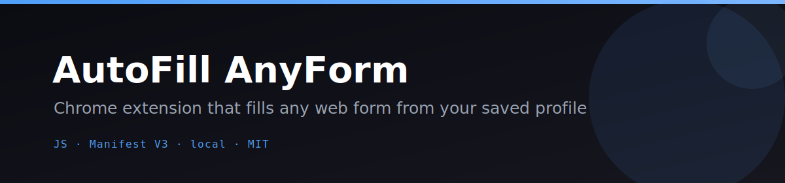
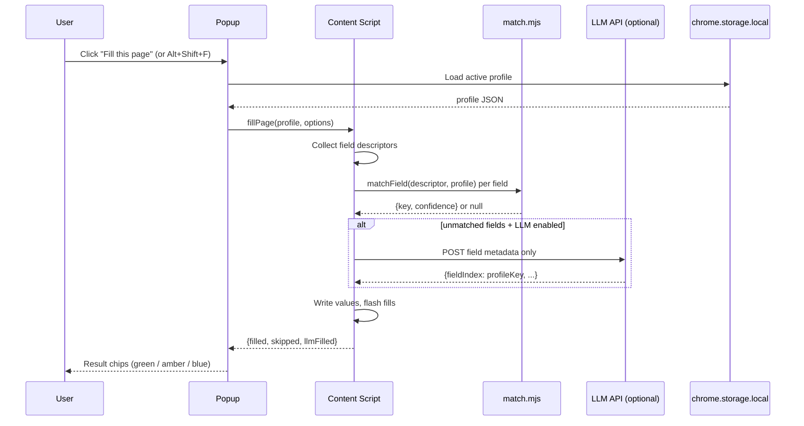

<p align="center"></p>

<p align="center">
  <a href="LICENSE"></a>
  
  
  
  
</p>

# 📝 AutoFill AnyForm

**One click to fill any web form from your saved profile — no browser sync, no cloud, no tracking.**

AutoFill AnyForm is a Chrome extension (Manifest V3) that detects form fields on any page and fills them from a local profile you control. It uses a specificity-ranked heuristic matcher and, when fields are ambiguous, an optional LLM second pass that sends only field metadata — never your personal data — to your chosen API endpoint. Everything else stays in `chrome.storage.local`.

---

## ✨ Features

- **Multiple profiles** — create "Personal", "Work", or any custom profile and switch between them from the popup.
- **Per-site default** — pin a profile to a domain; AutoFill remembers it for every future visit.
- **Smart heuristic matcher** — ranks `autocomplete`, `name`, `id`, `placeholder`, `aria-label`, and label text by specificity. "Company Name" maps to `company`, not `fullName`.
- **Confidence scores** — each match carries a confidence value; the popup shows filled / skipped / needs-LLM chips in color.
- **All field types** — `<input>`, `<select>`, checkboxes, radio groups, date inputs, and textareas.
- **Optional LLM second pass** — non-English labels, unusual field names? Route unmatched fields to any OpenAI-compatible endpoint. Only label metadata is sent.
- **Highlight unmatched fields** — toggle to paint unmatched fields amber so you see exactly what the LLM could help with.
- **Keyboard shortcut** — `Alt+Shift+F` fills the active page without opening the popup.
- **Import / Export profiles** — download a profile as JSON, edit it, re-import it.
- **Dark mode** — auto (respects `prefers-color-scheme`) with a manual toggle in both popup and Options.
- **Zero remote dependencies** — no `npm install` required to run, test, or package.

---

## 🎬 How it works



---

## 🚀 Quickstart

### 1. Load as an unpacked extension

1. Clone or download this repo.
2. Open `chrome://extensions/` in Chrome.
3. Enable **Developer mode** (top-right toggle).
4. Click **Load unpacked** and select the `autofill-anyform/` folder — the one containing `manifest.json`.
5. The AutoFill icon appears in your toolbar.

### 2. Set up your profile

1. Click the extension icon → **Options & Profiles** (or right-click → *Options*).
2. Under **Profiles**, use the default "Personal" profile or create a new one.
3. Fill in Identity, Address, and Work fields. Add **Custom Fields** for anything else.
4. Click **Save profile**.

### 3. Fill a form

Navigate to any page with a form and click the extension icon → **Fill this page**, or press `Alt+Shift+F`.

### 4. Run the tests

```bash
npm test
```

### 5. Package a distributable ZIP

```bash
npm run build:zip
# Writes dist/autofill-anyform.zip — ready for the Chrome Web Store dashboard.
```

### 6. Run the self-eval harness

```bash
npm run eval
# Prints PASS/FAIL for each criterion and exits 0 only when all pass.
```

---

## ⚙️ Configuration

All configuration lives in **Options** (right-click the icon → Options, or click **Options & Profiles** in the popup).

| Option | Where | Description |
|---|---|---|
| Profile fields | Options → Profiles | Name, address, work, custom key-value pairs |
| Active profile | Popup selector | Switch profiles per fill |
| Per-site default | Popup → "Use for this site" | Remember a profile for a domain |
| Highlight unmatched | Popup toggle | Paint unmatched fields amber |
| Theme | Options → Appearance | Auto / Light / Dark |
| LLM endpoint | Options → LLM | Your OpenAI-compatible base URL |
| LLM model | Options → LLM | e.g. `gpt-4o-mini`, `moonshot-v1-8k` |
| LLM API key | Options → LLM | Stored only in `chrome.storage.local` |

### Optional LLM integration

AutoFill supports any OpenAI-compatible chat completions API. Only field metadata (labels, names, placeholders) is ever sent — never your profile values.

```
LLM_BASE_URL  https://api.openai.com/v1/chat/completions   (default)
LLM_MODEL     gpt-4o-mini                                  (default)
LLM_API_KEY   sk-...                                       (your key)
```

Works out of the box with **OpenAI**, **Kimi / Moonshot** (`https://api.moonshot.cn/v1/chat/completions`), and any other OpenAI-compatible provider. When no LLM is configured, the heuristic matcher handles everything locally.

---

## 🗺️ Roadmap / Needs

The core fill pipeline is fully working. Here is what would make it even better:

- [ ] **Firefox / Edge support** — the MV3 manifest is mostly compatible; needs testing and minor adjustments.
- [ ] **Shadow DOM traversal** — reach fields inside open shadow roots.
- [ ] **Multi-step wizard support** — auto-advance and fill each step sequentially.
- [ ] **Chrome Web Store listing** — polish icons and write the store description.
- [ ] **Profile encryption at rest** — encrypt `chrome.storage.local` entries with a user passphrase.
- [ ] **Sync profiles** — optional `chrome.storage.sync` for profile portability across devices.

PRs and issues are very welcome.

---

## 📄 License

MIT © 2026 Alchemist-X — see [LICENSE](LICENSE).

---

<p align="center">If AutoFill AnyForm saves you time, give it a ⭐ — it helps others find the project.</p>
